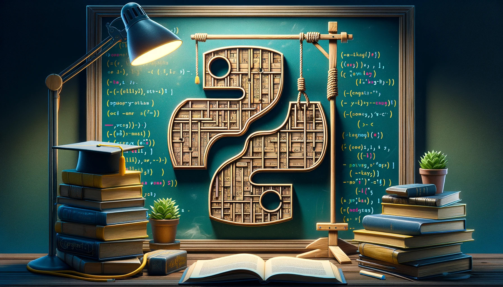
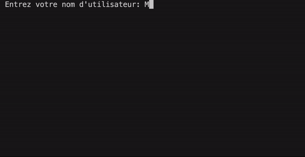

# PR01 : Le Bonhomme Pendu <a name="tp1"></a>

- [Introduction](#introduction)
- [Objectifs](#goals)
- [Description des Fonctionnalités du Jeu](#description)
  - [Aperçu Général](#overview)
  - [Fonctionnalités Requises](#required)
    - [1. Accueil et Nom d'Utilisateur](#welcome)
    - [2. Menu Principal](#main-menu)
    - [3. Choix de la Difficulté](#difficulty)
    - [4. Déroulement de la Partie](#gameplay)
    - [5. Historique des Parties](#history)
    - [6. Quitter le Jeu](#quit)
    - [7. Bonus: Nettoyage de la Console [OPTIONNEL]](#clear)
- [Guide de Progression](#progression)
- [Évaluation et Barème](#evaluation)
- [Remise](#submission)
- [Annexe: Guide et normes de codage](#appendix)

⏰ Date de remise le Dimanche 3 mars 23h59

## Introduction <a name="introduction"></a>

Bienvenue dans ce premier projet, la création de votre propre version d'un classique intemporel: le Bonhomme Pendu. Ce travail pratique est une opportunité unique pour vous d'explorer les fondamentaux de la programmation en Python à travers la conception et le développement d'un jeu interactif.

Ce travail vous guidera à travers les étapes dans le création d'un jeu complet, partant d'un menu principal jusqu'au coeur du jeu et à l'affichage de l'historique des parties. Cette démarche vous permettra de comprendre comment les différents éléments du jeu s'imbriquent les uns dans les autres, et comment les concepts de programmation sont appliqués pour créer une expérience de jeu engageante.

Ce projet est aussi conçu pour vous encourager à devenir un(e) chercheur(e) autonome. Vous serez invité à consulter la documentation Python et d'autres ressources en ligne pour apprendre de nouveaux concepts.

Préparez-vous à appliquer vos connaissances, à résoudre des problèmes et à développer un jeu interactif qui testera à la fois votre logique et votre créativité. 🧠



<p align="left"> <i>Crédits: <a href="https://openai.com/blog/dall-e/">DALLE 3</a></i></p>

## Objectifs <a name="goals"></a>

- Pratiquer la manipulation des chaînes de caractères.
- Comprendre et appliquer les boucles et les conditions.
- Apprendre à organiser et à structurer du code.
- Cultiver l'esprit de recherche et d'expérimentation et développer votre autonomie.
- Acquérir des compétences en résolution de problèmes à travers la conception logique et la mise en œuvre d'un jeu complet.

## Description des Fonctionnalités du Jeu <a name="description"></a>

### Aperçu Général <a name="overview"></a>

Le jeu du Bonhomme Pendu est un classique de la devinette et du mystère, où le joueur est mis au défi de deviner un mot secret en proposant des lettres une à une. À chaque proposition incorrecte, une partie supplémentaire du bonhomme pendu est dessinée. Le but ultime du jeu est de deviner le mot avant que le dessin du bonhomme ne soit complété, ajoutant ainsi un élément de suspense et de stratégie à chaque partie.

Afin de vous aider à mieux visualiser les différentes fonctionnalités du jeu, voici un exemple d'interface utilisateur. On vous encourage à faire preuve de créativité et à personnaliser l'interface à votre guise, ainsi que les messages du jeu, tant que les mêmes fonctionnalités sont implémentées et que les mêmes informations sont affichées à l'écran.



### Fonctionnalités Requises <a name="required"></a>

#### 1. Accueil et Nom d'Utilisateur (2 points) <a name="welcome"></a>

Le jeu commence par un message d'accueil engageant, suivi d'une invitation pour les joueurs à saisir leur nom d'utilisateur. Cette étape personnalise l'expérience du joueur et établit l'ambiance du jeu.

- Le nom d'utilisateur doit être composé d'au moins trois lettres. Si le joueur entre un nom invalide (comme un nom trop court ou contenant des chiffres ou des symboles), un message d'erreur apparaît, et une nouvelle saisie est demandée. Ce processus de validation garantit que chaque joueur commence le jeu avec un identifiant correct.

#### 2. Menu Principal (2 points) <a name="main-menu"></a>

Le menu principal est l'interface à travers laquelle les joueurs naviguent dans les différentes options du jeu, rendant l'expérience fluide et intuitive.

- Les options disponibles sont "Jouer", "Afficher l'Histoire" et "Quitter". En cas d'entrée invalide, un message d'erreur informe le joueur et invite à une nouvelle sélection.
- Lorsque "Jouer" est sélectionné, les joueurs sont dirigés vers un sous-menu pour choisir le niveau de difficulté du jeu, décrit plus en détail dans la section correspondante.

#### 3. Choix de la Difficulté (2 points) <a name="difficulty"></a>

Avant de commencer une partie, les joueurs doivent choisir un niveau de difficulté, une étape importante qui détermine la complexité du mot à deviner.

- Trois niveaux sont disponibles: `Facile`, `Intermédiaire`, et `Difficile`. Chaque niveau correspond à une liste de mots pré-établie, stockée dans un fichier donné dans le dossier `data`.
- Encore une fois, en cas d'entrée invalide, un message d'erreur informe le joueur et invite à une nouvelle sélection.

**Note importante sur la gestion des mots:** Pour faciliter le processus, une fonction (`lire_dictionnaires_mots`) est fournie. Cette fonction est essentielle pour lire le contenu du fichier "x.json" et le transformer en un dictionnaire pratique pour le jeu. Elle permet d'éviter de couvrir la lecture et l'écriture de fichiers durant les semaines de ce projet, permettant ainsi aux étudiants de se concentrer pleinement sur les fondamentaux de la programmation en Python.

- Exemple de structure renvoyée par la fonction (`lire_dictionnaires_mots`) :

  ```python
  {
      "facile": ["chat", "pomme", "soleil", ...],
      "intermediaire": ["ordinateur", "bibliotheque", ...],
      "difficile": ["cryptographie", "photosynthese", ...]
  }
  ```

  Cette structure montre comment les mots sont organisés par niveau de difficulté, offrant une claire distinction entre les options et permettant aux étudiants de choisir un défi adapté à leur niveau. En se concentrant sur l'application de cette structure dans le jeu, ils peuvent explorer des concepts de programmation clés tels que la manipulation de dictionnaires, les boucles, et la prise de décisions conditionnelles.

#### 4. Déroulement de la Partie (8 points) <a name="gameplay"></a>

Une fois le niveau de difficulté sélectionné, la partie commence. Les règles du jeu sont conçues pour être claires et sans ambiguïté, afin de renforcer les compétences de programmation des étudiants tout en fournissant un défi engageant.

##### Sélection et Affichage du Mot

- Un mot est choisi aléatoirement parmi la liste correspondant au niveau de difficulté choisi. Chaque lettre du mot est initialement représentée par un tiret bas `_`.
- Le mot caché est affiché à l'écran pour indiquer au joueur le nombre de lettres à deviner.

##### Saisie et Validation des Lettres

- Les joueurs saisissent une lettre à la fois.
- Si la lettre a déjà été proposée, le programme affiche un message lui précisant que la lettre a déjà été essayée et l'invitant à choisir une nouvelle. Aucun dessin supplémentaire n'est ajouté au bonhomme pendu pour cette entrée.
- Si la lettre saisie n'est pas alphabétique (par exemple, un chiffre ou un symbole), le programme affiche un message indiquant que l'entrée est invalide et invitant de nouveau l'utilisateur à tenter une autre lettre.
- Les lettres sont traitées sans distinction de casse.

##### Mise à Jour du Jeu et Gestion des Tentatives

- Chaque lettre correcte saisie par l'utilisateur est révélée dans le mot caché.
- Chaque erreur (lettre incorrecte) saisie par l'utilisateur ajoute une partie au dessin du bonhomme pendu.
- Le bonhomme pendu est complété en **6 tentatives erronées**. Cela signifie que le joueur a droit à 6 erreurs avant d'être "pendu" à la septième erreur.
- Le dessin du bonhomme pendu évolue progressivement avec chaque erreur, représentant visuellement le nombre de tentatives restantes.

##### Fin de la Partie

- Le jeu se termine soit par la devinette complète du mot (victoire), soit par la réalisation complète du dessin du bonhomme pendu (défaite).
- Un message indique le résultat de la partie. Voici des exemples de messages à afficher (modifiez-les à votre guise, tout en conservant les informations essentielles) :
  - Victoire : Félicitations **_[nom]_** ! Vous avez deviné le mot **_[mot]_** en **_[temps écoulé]_** secondes et **_[nombre d'essais]_** tentatives échouées.
  - Défaite : Dommage ! Le mot était **_[mot]_**."
- Le résultat de la partie doit être enregistré dans le fichier d'historique, décrit plus en détail dans la section correspondante.

**Note :** Je vous recommande de lire la [documentation suivante](https://www.geeksforgeeks.org/how-to-check-the-execution-time-of-python-script/) afin de mieux comprendre comment chronométrer la durée d'une partie.

#### Retour au Menu Principal

- Après chaque partie, un message invite le joueur à appuyer sur **_Enter_** pour revenir au menu principal.

### 5. Historique des Parties (5 points) <a name="history"></a>

Cette fonctionnalité permet aux joueurs de consulter un historique de leurs parties précédentes, offrant un aperçu de leurs performances.

#### Sauvegarde de l'Historique

À la fin de chaque partie, le résultat est enregistré dans un fichier d'historique, permettant aux joueurs de consulter leurs performances passées (voir la section suivante pour plus de détails).

Pour simplifier le processus de sauvegarde des données du jeu, une fonction spécifique est fournie. La fonction `enregistrer_partie`, prend en charge l'enregistrement de chaque partie jouée.

##### Fonction `enregistrer_partie`

- **Paramètres :**
  - `nom_utilisateur`: Le nom de l'utilisateur.
  - `mot`: Le mot utilisé dans la partie.
  - `a_gagne`: Un booléen indiquant si l'utilisateur a gagné ou perdu.
  - `duree`: La durée de la partie.

##### Exemple d'utilisation de la fonction `enregistrer_partie`:

```python
enregistrer_partie("Alex", "cryptographie", False, 130)
```

Dans cet exemple, la partie jouée par l'utilisateur "Alex" avec le mot "cryptographie" est enregistrée. L'utilisateur a perdu la partie qui a duré 130 secondes.

#### Affichage de l'Historique

Les joueurs peuvent consulter leurs performances passées en affichant l'historique des parties précédentes. Lorsqu'on sélectionne l'option _Afficher l'Historique_ dans le menu principal, l'historique du joueur est affiché à l'écran.

- Chaque entrée dans l'historique comprend le mot joué, le résultat (gagné/perdu) et le temps écoulé.
- L'historique est présenté sous forme de liste ou de tableau, facilitant la consultation des informations passées.
- Après consultation de l'historique, un message offre la possibilité de retourner au menu principal en appuyant sur **_Enter_**.

Encore une fois, une fonction est fournie pour vous aider à lire les données du fichier d'historique. La fonction `lire_historique_utilisateur` prend en charge la lecture des données de l'historique et les renvoie sous forme de liste.

##### Fonction `lire_historique_utilisateur`

- **Paramètre :**
  - `nom_utilisateur`: Le nom de l'utilisateur pour lequel afficher l'historique.
- **Fonctionnement :**
  - La fonction `lire_historique_utilisateur` lit les données de l'historique à partir du fichier de sauvegarde et retourne un tableau de dictionnaires contenant les détails des parties jouées par l'utilisateur spécifié.
- **Structure du Tableau Renvoyé :**
  - Chaque élément du tableau est un dictionnaire avec des clés pour le mot joué, le résultat, la durée, et le timestamp de la partie.

##### Exemple d'utilisation de la fonction `lire_historique_utilisateur`:

```python
historique_joueur = lire_historique_utilisateur("Alex")
```

##### Structure du Tableau Renvoyé :

```python
[
  {
    "timestamp": "2024-01-20 14:30",
    "mot": "cryptographie",
    "resultat": False,
    "duree": 130
  },
  {
    "timestamp": "2024-01-18 09:15",
    "mot": "soleil",
    "resultat": True,
    "duree": 75
  }
]
```

Dans cet exemple, deux parties ont été jouées par l'utilisateur "Alex". La première partie a eu lieu le 20 janvier 2024 à 14h30, et l'utilisateur a perdu en 130 secondes en essayant de deviner le mot "cryptographie". La deuxième partie a eu lieu le 18 janvier 2024 à 9h15, et l'utilisateur a gagné en 75 secondes en devinant le mot "soleil".

**Note 1** : Les fonctions fournies pour vous aider à lire et à écrire dans le fichier d'historique se trouvent dans le fichier `util.py`. Vous pouvez consulter le fichier pour plus de détails et d'exemples d'utilisation.

**Note 2** : En tout temps, si vous avez besoin de réinitialiser l'historique, vous pouvez exécuter le fichier `reinitialiser_historique.py` pour supprimer la sauvegarde existante et créer un nouveau fichier d'historique vide.

### 6. Quitter le Jeu (1 point) <a name="quit"></a>

Lorsqu'on sélectionne l'option _Quitter_ dans le menu principal, le jeu se termine et un message d'adieu est affiché à l'écran.

- Le message doit inclure le nom d'utilisateur du joueur, pour une expérience personnalisée et engageante.

### 7. Bonus: Nettoyage de la Console [OPTIONNEL] (2 point) <a name="clear"></a>

En tant que défi supplémentaire, vous êtes encouragé à implémenter une fonctionnalité pour nettoyer la console à chaque changement d'affichage. Cette pratique permet de maintenir un affichage épuré et professionnel, en présentant uniquement les informations nécessaires à l'écran, améliorant ainsi l'expérience utilisateur. Cela permettra donc d'éviter l'accumulation d'informations inutiles à l'écran, et de garder l'interface du jeu propre et lisible.

Cette fonctionnalité est facultative et vous permet de gagner 2 point bonus sur 20.

Petit indice: `clear python console` peut être un bon point de départ pour vos recherches sur Google. 🕵️‍♂️🕵️‍♀️

## Guide de Progression <a name="progression"></a>

Le but de cette section est de vous aider à progresser de manière structurée dans votre projet, en alignant vos efforts de développement avec les compétences acquises au fil des semaines.

### Semaine 1

- [ ] Implémenter l'accueil et la saisie du nom d'utilisateur en boucle, jusqu'à ce que le nom soit valide.
- [ ] Implémenter le menu principal et la boucle de sélection des options.
- [ ] Implémenter le menu de sélection de la difficulté de la partie (sans la sélection aléatoire du mot).
- [ ] Implémenter le message d'adieu en cas de sortie du jeu.

### Semaine 2

- [ ] Implémenter un premier jet de la boucle de jeu principale à l'aide d'un mot prédéfini (hardcodé): le mot doit être affiché à l'écran, et les lettres saisies par l'utilisateur doivent impacter l'affichage du mot si elles sont correctes, ou le dessin du bonhomme pendu si elles sont incorrectes (sans la validation des entrées). On suppose que toutes les entrées sont correctes pour le moment.
- [ ] Implémenter le mécanisme permettant de chronométrer la durée de la partie.
- [ ] Afficher en fin de partie les informations demandées relatives au résultat de la partie.

### Semaine 3

- [ ] Implémenter la sélection aléatoire du mot à partir de la liste correspondant au niveau de difficulté choisi.
- [ ] Implémenter la validation des entrées utilisateur (lettres déjà proposées, entrées non alphabétiques, casse des lettres, etc.).
- [ ] Implémenter la sauvegarde des résultats en fin de partie dans le fichier d'historique.
- [ ] Implémenter l'affichage de l'historique des parties.

### Semaine 4

- [ ] S'assurer que toutes les parties du jeu fonctionnent ensemble de manière fluide.
- [ ] Tester le jeu en jouant plusieurs parties, en vérifiant l'historique, et en s'assurant que toutes les options du menu fonctionnent correctement.
- [ ] Implémenter le nettoyage de la console à chaque changement d'affichage (optionnel).

**Note:** Cette décomposition des tâches n'est pas exhaustive, elle tente seulement de vous donner une idée générale. Vous pouvez l'adapter en fonction de votre rythme de travail et de votre progression.

### Conseils

- Lisez attentivement les descriptions des fonctionnalités et les exemples fournis pour vous assurer de bien comprendre ce qui est attendu de vous.
- N'hésitez à décomposer et documenter le code pour mieux comprendre son fonctionnement.
- Testez régulièrement votre code au fur et à mesure que vous développez pour éviter les erreurs complexes à la fin.
- Discutez avec vos collègues et vos assistants pour partager et "brainstorm" vos idées et vos progrès.
- N'oubliez pas de vous amuser et de faire preuve de créativité ! 🎉

## Évaluation et Barème <a name="evaluation"></a>

L'évaluation de ce projet se concentre exclusivement sur les tests de fonctionnalité. Chaque section du projet est évaluée selon son fonctionnement corrects, conformément aux exigences décrites plus haut. Voici un résumé des pondérations :

| Question                     | Points |
| :--------------------------- | -----: |
| Accueil et Nom d'Utilisateur |      2 |
| Menu Principal               |      2 |
| Choix de la Difficulté       |      2 |
| Déroulement de la Partie     |      8 |
| Historique des Parties       |      5 |
| Quitter le Jeu               |      1 |
| Nettoyage console (bonus)    |     +2 |
| **Total**                    | **20** |

## Remise du Travail <a name="submission"></a>

Pour soumettre votre projet, veuillez créer un fichier zip nommé `LXX-YYYYYYY-PR01.zip`, où `XX` est le numéro de votre section de laboratoire et `YYYYYYY` votre matricule.

Votre fichier zip doit contenir tous les scripts Python que vous avez développés pour le projet, y compris le script principal du jeu, ainsi que les éventuels scripts auxiliaires pour la gestion de l'historique (`util.py`). Assurez-vous que votre jeu final fonctionne correctement, et qu'il s'exécute de manière autonome. Il est également conseillé de tester à la fin l'intégralité du jeu pour vérifier sa conformité avec les exigences du projet.

Une fois cette vérification terminée, déposez votre fichier zip dans la boîte Moodle dédiée au travail pratique, correspondant à votre section de laboratoire.

## Bon succès à tou.te.s ! 🚀
